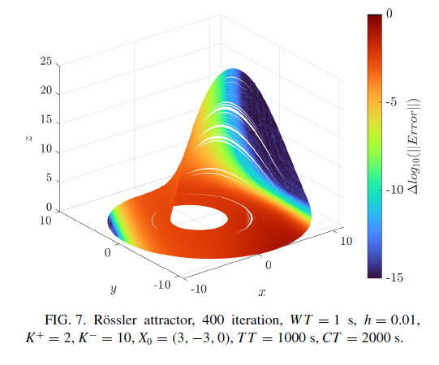
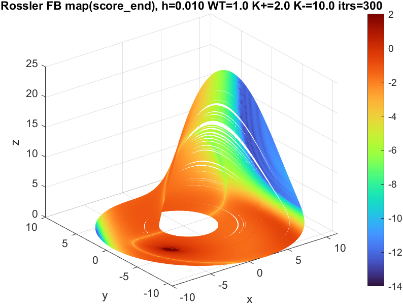
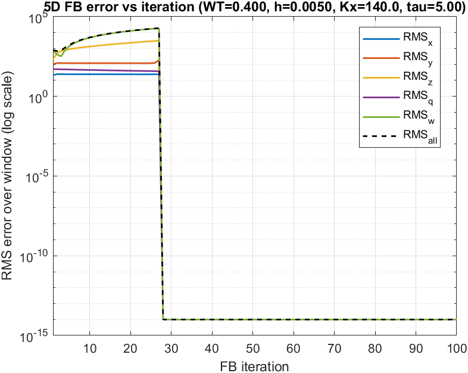
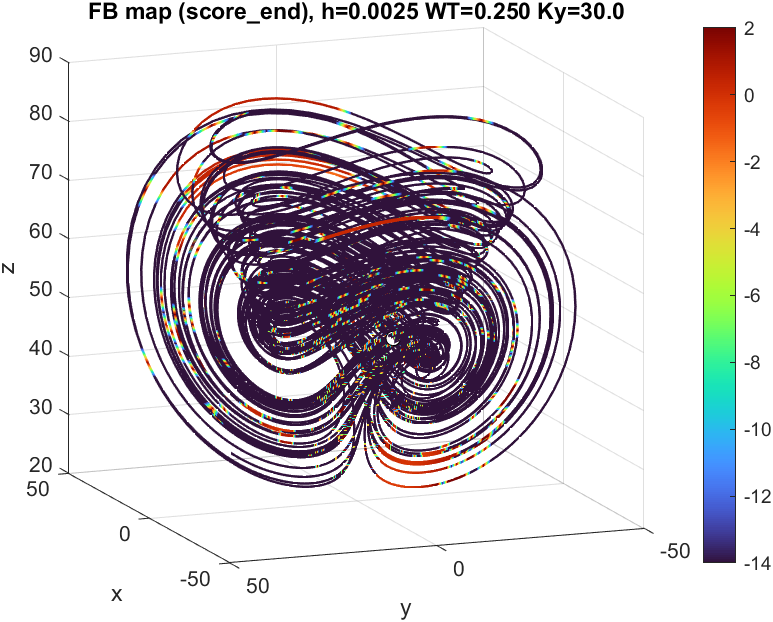

# MNDS Coursework (MATLAB)

Курсовая работа по синхронизации хаотических систем с использованием time‑reversible подхода. Реализация и постановка следуют статье «Fast time‑reversible synchronization of chaotic systems» (скрины статьи приложены в репозитории), поэтому структура расчётов, метрики и выбор тестовых систем согласованы с методикой из статьи.

## Что сделано

- Реализованы схемы прямого/обратного прохода и time‑reversible синхронизации для нескольких систем.
- Проведён параметрический перебор (grid search) по шагу интегрирования `h`, окну `WT` и коэффициентам обратной связи `K`.
- Сформированы:
  - фазовые портреты (phase portraits),
  - графики ошибки синхронизации во времени (error curves),
  - карты качества по параметрам (`FBmap`/`5DFBmap`),
  - лог‑файлы сканирования (`SCAN_logs.txt`).

## Структура папки

- `Hyperchen4D/` — 4‑мерная система Hyper‑Chen.
  - `X/`, `Y/`, `Z/`, `Q/` — расчёты и графики для синхронизации по отдельным переменным.
- `Hyperchen5D_with_feedback/` — 5‑мерная Hyper‑Chen с обратной связью.
  - `X/`, `Y/`, `Z/`, `Q/`, `W/` — результаты по каждой переменной.
- `Hyperchen5D_without_feedback/` — 5‑мерная Hyper‑Chen без обратной связи.
  - `Y/` — расчёты для выбранной переменной.
- `Rössler/` — система Рёсслера.

## Пример перебора параметров

Ниже — фрагмент `SCAN_logs.txt` (Hyper‑Chen 4D, переменная **Y**). Показаны топ‑конфигурации по метрикам синхронизации и итоговый лучший набор параметров:

```text
Grid search: 3 h * 7 WT * 11 Ky = 231 configs
BEST: h=0.0010 WT=0.080 Ky=2.0 | strong=0.00 medMin=-0.11 medEnd=0.27 endNeg=0.29
BEST: h=0.0010 WT=0.120 Ky=20.0 | strong=0.12 medMin=-0.02 medEnd=0.72 endNeg=0.28
BEST: h=0.0010 WT=0.180 Ky=10.0 | strong=0.49 medMin=-1.42 medEnd=-0.22 endNeg=0.51
BEST: h=0.0010 WT=0.220 Ky=10.0 | strong=0.95 medMin=-14.89 medEnd=-14.89 endNeg=0.95
BEST: h=0.0025 WT=0.250 Ky=30.0 | strong=1.00 medMin=-14.80

Best found: h=0.0025 WT=0.250 Ky=30.0 | strong=1.00 medMin=-14.80
```

Полный лог: `Hyperchen4D/Y/SCAN_logs.txt`.

## Примеры визуализаций

### Фазовый портрет

Пример фазового портрета для системы Рёсслера (из статьи):



Пример фазового портрета для системы Рёсслера (полученный в ходе выполнения курсовой работы):



### График ошибки по окну (error vs time window)

Пример ошибки синхронизации по времени для Hyper‑Chen 5D с обратной связью (переменная **X**):



### Фазовый портрет для Hyper‑Chen

Пример фазового портрета для Hyper‑Chen 4D (переменная **Y**):



